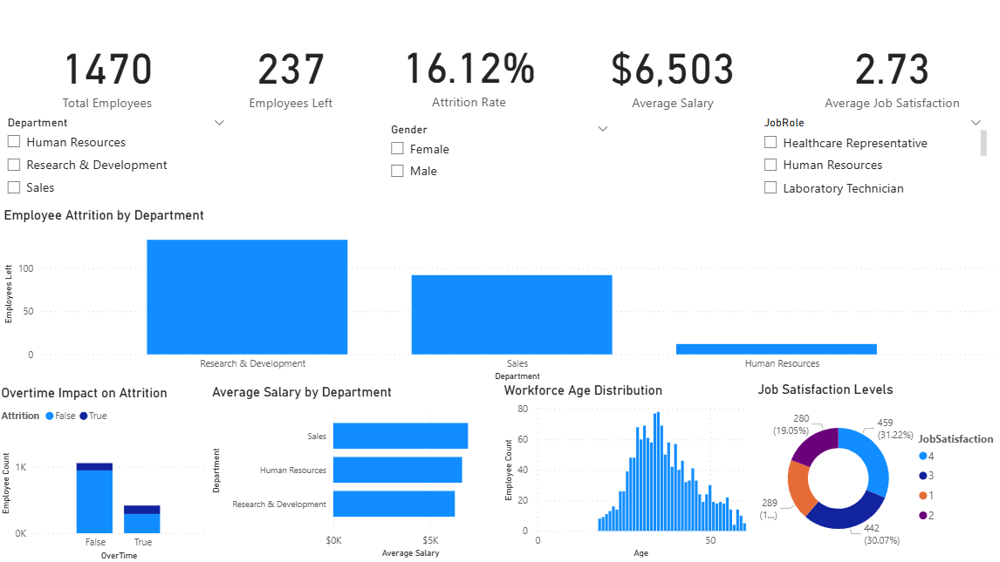
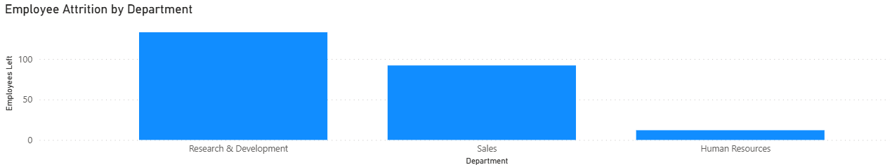
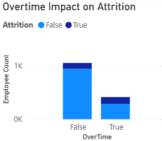
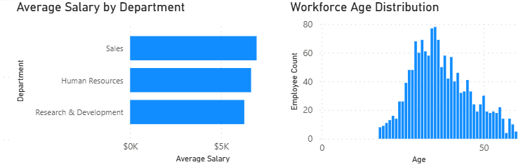

# 👥 HR Analytics Dashboard

## 📌 Overview

This project analyzes employee attrition, workforce demographics, salary distribution, and job satisfaction using SQL Server and Power BI. The dashboard provides workforce insights that support employee retention and strategic HR decision-making.

---

## 🛠️ Tools Used

- SQL Server
- Power BI
- Power Query
- Microsoft Excel

---

## 📊 Dashboard Features

- KPI cards for Total Employees, Employees Left, Attrition Rate, Average Salary, and Average Job Satisfaction
- Employee attrition analysis by department
- Overtime impact on attrition
- Salary analysis by department
- Workforce age distribution
- Job satisfaction analysis
- Interactive filtering and slicers

---

## 💡 Key Insights

1. Research & Development experienced the highest employee attrition, followed by Sales and Human Resources.
2. Employees working overtime showed a higher likelihood of leaving the organisation.
3. Average salary levels varied across departments, reflecting differences in job functions and responsibilities.
4. The workforce was primarily concentrated within the mid-career age range.
5. The overall attrition rate highlights the importance of retention initiatives and workforce planning strategies.

---

## 📈 Business Value

This dashboard helps HR stakeholders monitor workforce trends, identify attrition risks, evaluate employee retention, and support strategic workforce planning.

---

## 📷 Dashboard Screenshots

### Dashboard Overview


### Attrition Analysis




### Salary & Workforce Analysis


---

## 📂 Project Structure

```plaintext
hr-analytics-dashboard/
│
├── hr_data.csv
├── hr_analysis.sql
├── hr_analytics_dashboard.pbix
├── README.md
├── hr_insights.txt
└── screenshots/
    ├── dashboard_overview.png
    ├── attrition_analysis_employee_attrition_by_department.png
    ├── attrition_analysis_overtime_impact_on_attrition.png
    └── salary_analysis.png
```

## 🎯 Key Takeaway

This project demonstrates the use of SQL Server and Power BI to analyze workforce data, identify attrition drivers, and support evidence-based HR decision-making.
